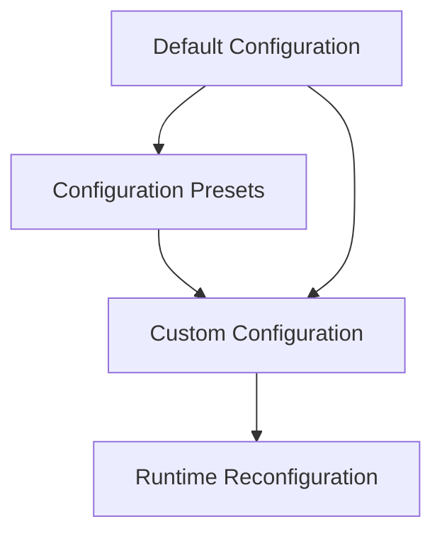

# Configuration Overview

Sherlock AI provides flexible configuration options to customize logging behavior for your specific needs. From simple presets to advanced custom configurations, you have complete control over how monitoring and logging works in your application.

## Quick Configuration

### Using Presets

The easiest way to configure Sherlock AI:

```python
from sherlock_ai import sherlock_ai, LoggingPresets

# Development environment
sherlock_ai(LoggingPresets.development())

# Production environment
sherlock_ai(LoggingPresets.production())

# Minimal setup
sherlock_ai(LoggingPresets.minimal())
```

[Learn more about presets →](presets.md)

### JSON Format

Choose between standard logs and JSON format:

```python
from sherlock_ai import sherlock_ai

# Standard format (default) - creates .log files
sherlock_ai()

# JSON format - creates .json files
sherlock_ai(format_type="json")
```

[Learn more about JSON logging →](json-logging.md)

## Configuration Hierarchy



## Configuration Components

### LoggingConfig

Main configuration class that controls all aspects of logging:

```python
from sherlock_ai import LoggingConfig

config = LoggingConfig(
    logs_dir="logs",              # Log directory
    log_format_type="json",       # "log" or "json"
    console_enabled=True,         # Enable console output
    console_level="INFO",         # Console log level
    log_files={...},              # Log file configurations
    loggers={...}                 # Logger configurations
)
```

[Learn more →](custom-config.md)

### LogFileConfig

Configure individual log files:

```python
from sherlock_ai import LogFileConfig

log_file = LogFileConfig(
    filename="app",               # Base filename
    level="INFO",                 # Log level
    max_bytes=10*1024*1024,      # Max file size (10MB)
    backup_count=5,              # Number of backups
    enabled=True                 # Enable/disable file
)
```

### LoggerConfig

Configure individual loggers:

```python
from sherlock_ai import LoggerConfig

logger_config = LoggerConfig(
    name="myapp.api",            # Logger name
    level="INFO",                # Logger level
    log_files=["app", "api"],    # Files to write to
    propagate=True,              # Propagate to parent
    enabled=True                 # Enable/disable logger
)
```

## Configuration Methods

### Function-Based API

Simple configuration for most use cases:

```python
from sherlock_ai import sherlock_ai, LoggingPresets

# Default configuration
sherlock_ai()

# With preset
sherlock_ai(LoggingPresets.production())

# With format type
sherlock_ai(format_type="json")
```

### Class-Based API

Advanced configuration with more control:

```python
from sherlock_ai import SherlockAI, LoggingConfig

config = LoggingConfig(...)
logger_manager = SherlockAI(config=config)
logger_manager.setup()

# Later, reconfigure without restart
new_config = LoggingConfig(...)
logger_manager.reconfigure(new_config)
```

[Learn more about class-based API →](../advanced/class-based-api.md)

## Configuration Options

### Log Directory

```python
config = LoggingConfig(
    logs_dir="application_logs"  # Custom directory
)
```

### Console Output

```python
config = LoggingConfig(
    console_enabled=True,        # Enable console
    console_level="DEBUG"        # Console log level
)
```

### File Rotation

```python
config = LoggingConfig(
    log_files={
        "app": LogFileConfig(
            "app",
            max_bytes=100*1024*1024,  # 100MB
            backup_count=10           # Keep 10 backups
        )
    }
)
```

### Enable/Disable Log Files

```python
config = LoggingConfig()
config.log_files["api"].enabled = False      # Disable API logs
config.log_files["services"].enabled = False  # Disable services logs
```

[Learn more about log management →](log-management.md)

## Environment-Specific Configuration

Configure based on environment:

```python
import os
from sherlock_ai import sherlock_ai, LoggingPresets, LoggingConfig, LogFileConfig

env = os.getenv("ENVIRONMENT", "development")

if env == "production":
    sherlock_ai(LoggingPresets.production())
elif env == "development":
    sherlock_ai(LoggingPresets.development())
elif env == "testing":
    config = LoggingConfig(
        logs_dir="test_logs",
        console_enabled=False,
        log_files={"test_results": LogFileConfig("results")}
    )
    sherlock_ai(config)
else:
    sherlock_ai()  # Default
```

## Default Log Files

When using default configuration, these log files are created:

| File | Purpose | Logger | Level |
|------|---------|--------|-------|
| `app.log` | All application logs | Root logger | INFO+ |
| `errors.log` | Error logs only | All loggers | ERROR+ |
| `api.log` | API logs | app.api | INFO+ |
| `database.log` | Database logs | app.core.dbConnection | INFO+ |
| `services.log` | Service logs | app.services | INFO+ |
| `performance.log` | Performance monitoring | PerformanceLogger | INFO+ |

## Configuration Best Practices

### 1. Use Presets for Common Scenarios

```python
# Development
sherlock_ai(LoggingPresets.development())

# Production
sherlock_ai(LoggingPresets.production())
```

### 2. Customize Only What You Need

```python
# Start with a preset, then customize
config = LoggingPresets.production()
config.console_level = "WARNING"
config.log_files["app"].max_bytes = 100*1024*1024
sherlock_ai(config)
```

### 3. Use Environment Variables

```python
import os

config = LoggingConfig(
    logs_dir=os.getenv("LOG_DIR", "logs"),
    console_level=os.getenv("LOG_LEVEL", "INFO")
)
```

### 4. Disable Unused Log Files

```python
config = LoggingConfig()
config.log_files["services"].enabled = False
config.log_files["database"].enabled = False
sherlock_ai(config)
```

## Configuration Sections

Explore each configuration topic in detail:

- **[Configuration Presets](presets.md)** - Ready-made configurations for common scenarios
- **[Custom Configuration](custom-config.md)** - Build your own configuration
- **[JSON Logging](json-logging.md)** - Structured logging with JSON format
- **[Log Management](log-management.md)** - File rotation, sizing, and management

## Next Steps

- [Quick Start](../quick-start.md) - Get started with basic configuration
- [API Reference](../api-reference/configuration.md) - Complete configuration API
- [Advanced](../advanced/runtime-reconfiguration.md) - Runtime reconfiguration
- [Examples](../examples/index.md) - Configuration examples

