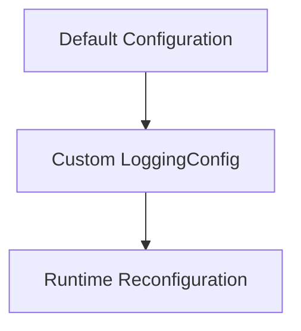

# Configuration Overview

Sherlock AI provides flexible configuration options to customize logging behavior for your specific needs. From simple defaults to advanced custom configurations, you have complete control over how monitoring and logging works in your application.

## Quick Configuration

### Default Setup

The quickest way to get started — default configuration uses JSON format:

```python
from sherlock_ai import SherlockAI

logger_manager = SherlockAI()
logger_manager.setup()
```

### JSON Format (default)

JSON is the default format and creates `.json` log files:

```python
from sherlock_ai import SherlockAI, LoggingConfig

# Explicitly JSON (same as default)
logger_manager = SherlockAI(LoggingConfig(log_format_type="json"))
logger_manager.setup()
```

### Standard Text Format

Use `"log"` to get human-readable `.log` files instead:

```python
from sherlock_ai import SherlockAI, LoggingConfig

logger_manager = SherlockAI(LoggingConfig(log_format_type="log"))
logger_manager.setup()
```

[Learn more about JSON logging →](json-logging.md)

## Configuration Hierarchy


```mermaid
graph TD
    DefaultConfig[Default Configuration] --> CustomConfig[Custom LoggingConfig]
    CustomConfig --> RuntimeReconfig[Runtime Reconfiguration]
```

## Configuration Components

### LoggingConfig

Main configuration class that controls all aspects of logging:

```python
from sherlock_ai import LoggingConfig

config = LoggingConfig(
    logs_dir="logs",                  # Log directory
    log_format_type="json",           # "log" or "json" (default: "json")
    console_enabled=True,             # Enable console output
    console_level="INFO",             # Console log level
    auto_instrument=True,             # Auto-instrument FastAPI routes
    monitor_resources=False,          # Enable resource monitoring by default
    monitor_memory=False,             # Enable memory monitoring by default
    performance_insights=True,        # Enable AI performance insights
    log_files={...},                  # Log file configurations
    loggers={...}                     # Logger configurations
)
```

[Learn more →](custom-config.md)

### LogFileConfig

Configure individual log files:

```python
from sherlock_ai import LogFileConfig

log_file = LogFileConfig(
    filename="app",               # Base filename (auto-expanded with logs_dir + extension)
    level="INFO",                 # Log level
    max_bytes=10*1024*1024,      # Max file size (10MB)
    backup_count=5,              # Number of backups
    enabled=True                 # Enable/disable file
)
```

### LoggerConfig

Configure individual loggers:

```python
from sherlock_ai import LoggerConfig

logger_config = LoggerConfig(
    name="PerformanceLogger",    # Logger name
    level="INFO",                # Logger level
    log_files=["performance"],   # Files to write to
    propagate=False,             # Propagate to parent
    enabled=True                 # Enable/disable logger
)
```

## Configuration Methods

### Class-Based API (recommended)

```python
from sherlock_ai import SherlockAI, LoggingConfig

# Default configuration
logger_manager = SherlockAI()
logger_manager.setup()

# With a custom config
config = LoggingConfig(log_format_type="log", console_level="DEBUG")
logger_manager = SherlockAI(config=config)
logger_manager.setup()
```

### Runtime Reconfiguration

Change configuration without restarting:

```python
new_config = LoggingConfig(console_level="WARNING")
logger_manager.reconfigure(new_config)
```

[Learn more about class-based API →](../advanced/class-based-api.md)

## Configuration Options

### Log Directory

```python
config = LoggingConfig(
    logs_dir="application_logs"  # Custom directory
)
```

### Console Output

```python
config = LoggingConfig(
    console_enabled=True,        # Enable console
    console_level="DEBUG"        # Console log level
)
```

### File Rotation

```python
config = LoggingConfig(
    log_files={
        "app": LogFileConfig(
            "app",
            max_bytes=100*1024*1024,  # 100MB
            backup_count=10           # Keep 10 backups
        )
    }
)
```

### Enable/Disable Log Files

```python
config = LoggingConfig()
config.log_files["monitoring"].enabled = False         # Disable monitoring logs
config.log_files["performance_insights"].enabled = False  # Disable AI insights logs
```

[Learn more about log management →](log-management.md)

## Environment-Specific Configuration

Configure based on environment using `LoggingConfig` directly:

```python
import os
from sherlock_ai import SherlockAI, LoggingConfig, LogFileConfig

env = os.getenv("ENVIRONMENT", "development")

if env == "production":
    config = LoggingConfig(
        log_format_type="json",
        console_level="WARNING",
        log_files={
            "app": LogFileConfig("app", max_bytes=50*1024*1024, backup_count=10),
            "errors": LogFileConfig("errors", level="ERROR", max_bytes=50*1024*1024, backup_count=10),
            "performance": LogFileConfig("performance", max_bytes=50*1024*1024, backup_count=10),
        }
    )
elif env == "development":
    config = LoggingConfig(
        log_format_type="log",
        console_level="DEBUG",
        root_level="DEBUG"
    )
elif env == "testing":
    config = LoggingConfig(
        logs_dir="test_logs",
        console_enabled=False,
        log_files={"test_results": LogFileConfig("results")}
    )
else:
    config = LoggingConfig()  # defaults

SherlockAI(config).setup()
```

## Default Log Files

When using the default configuration, these log files are created (`.json` extension by default):

| File | Purpose | Logger | Level |
|------|---------|--------|-------|
| `app.json` | All application logs | Root logger | INFO+ |
| `errors.json` | Error logs only | All loggers | ERROR+ |
| `performance.json` | Performance monitoring | `PerformanceLogger` | INFO+ |
| `monitoring.json` | Memory & resource monitoring | `MonitoringLogger` | INFO+ |
| `error_insights.json` | AI-generated error analysis | `ErrorInsightsLogger` | INFO+ |
| `performance_insights.json` | AI-generated performance analysis | `PerformanceInsightsLogger` | INFO+ |

## Auto-Instrumentation Options

Control how Sherlock AI instruments your application:

```python
config = LoggingConfig(
    auto_instrument=True,              # Instrument FastAPI routes automatically (default: True)
    auto_frameworks=["fastapi"],       # Frameworks to instrument
    auto_trace_functions=False,        # Trace all function calls (default: False)
    auto_min_duration=0.0,             # Min duration (s) to log traced functions
    auto_exclude_modules=["sys", "os", "logging"]  # Modules to skip
)
```

## Configuration Best Practices

### 1. Customize Only What You Need

```python
# Start with defaults, then override specific values
config = LoggingConfig(
    console_level="WARNING",
    log_files={
        "app": LogFileConfig("app", max_bytes=100*1024*1024)
    }
)
SherlockAI(config).setup()
```

### 2. Use Environment Variables

```python
import os

config = LoggingConfig(
    logs_dir=os.getenv("LOG_DIR", "logs"),
    console_level=os.getenv("LOG_LEVEL", "INFO"),
    log_format_type=os.getenv("LOG_FORMAT", "json")
)
```

### 3. Disable Unused Log Files

```python
config = LoggingConfig()
config.log_files["performance_insights"].enabled = False
config.log_files["error_insights"].enabled = False
SherlockAI(config).setup()
```

## Configuration Sections

Explore each configuration topic in detail:

- **[Custom Configuration](custom-config.md)** - Build your own configuration
- **[JSON Logging](json-logging.md)** - Structured logging with JSON format
- **[Log Management](log-management.md)** - File rotation, sizing, and management

## Next Steps

- [Quick Start](../quick-start.md) - Get started with basic configuration
- [API Reference](../api-reference/configuration.md) - Complete configuration API
- [Advanced](../advanced/runtime-reconfiguration.md) - Runtime reconfiguration
- [Examples](../examples/index.md) - Configuration examples
